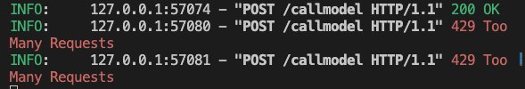

# CircuitStream 🌐⚡

A universal Language Model relay system, making it seamless to integrate with various models across different platforms! Designed to help developers achieve interoperability without hassles. 

This type of relay is also useful if you're an organization with a single account distributed accross multiple teams or developers as rate limit can be configured at a per model level.

If you're running tests against multiple LLMs this is also a great way to generate centralized analytics.

[](https://opensource.org/licenses/MIT)  

---

## Features 🌟
- **Unified Interface**: One API to rule them all! Easily call different models through a standardized interface.
- **Configurable**: Add or modify endpoints without touching the core logic.
- **Rate Limiting**: Safeguard against excessive requests with built-in rate limiting.

- **Analytics**: Dive deep into request analytics with logging and insights.

- **Cross-Origin Resource Sharing (CORS)**: Built-in CORS support, making it browser friendly.

---

## Getting Started 🚀

### Prerequisites
- Python 3.8+
- Virtual Environment (recommended)

### Setup & Installation

1. Clone the repository:
```bash
git clone https://github.com/balgan/CircuitStream.git
cd CircuitStream
```

2. Create and activate a virtual environment (Optional but recommended):
```bash
python -m venv venv
source venv/bin/activate  # On Windows use `venv\Scripts\activate`
```

3. Install the dependencies:
```bash
pip install -r requirements.txt
```

4. Modify the `config.json` file to match your desired configuration for various language models and platforms.

5. Run the relay:
```bash
python llm_relay.py
```

6. Run a webserver to view the index:
```bash
python -m http.server 8081
```

Now, your CircuitStream relay is up and running on `http://localhost:8000/` and you can also browse `http://localhost:8081` to view analytics.

---

## Usage 🖥️

Here's how to send a request:

```bash
curl -X POST http://localhost:8000/callmodel \
  -H "Content-Type: application/json" \
  -d '{
    "project_name": "openai",
    "model_name": "gpt-4",
    "prompt": "Hello World!",
    "api_token": "your-api-key-here"
  }'

curl -X POST http://localhost:8000/callmodel \
  -H "Content-Type: application/json" \
  -d '{
    "project_name": "anthropic",
    "model_name": "claude-2",
    "prompt": "H\nHuman: Hello, world!\n\nAssistant:",
    "api_token": "your-api-key-here"
  }'

```

For additional routes and functionalities, refer to the API documentation generated with FastAPI.

---

## Contributing 🤝

We love contributions! If you have any improvements or feature suggestions, please:

1. Fork the Project
2. Create your Feature Branch (`git checkout -b feature/FeatureName`)
3. Commit your Changes (`git commit -m 'Add some FeatureName'`)
4. Push to the Branch (`git push origin feature/FeatureName`)
5. Open a Pull Request

---

## License 📜

Distributed under the MIT License. See `LICENSE` for more information.

---

## Acknowledgements 🎉

- [OpenAI](https://www.openai.com/)
- [Anthropic](https://www.anthropic.com/)
- [FastAPI](https://fastapi.tiangolo.com/)
- All the contributors ❤️

---

## Support 🌐

Having issues? [Open an issue](https://github.com/balgan/CircuitStream/issues) and let's debug it together!

